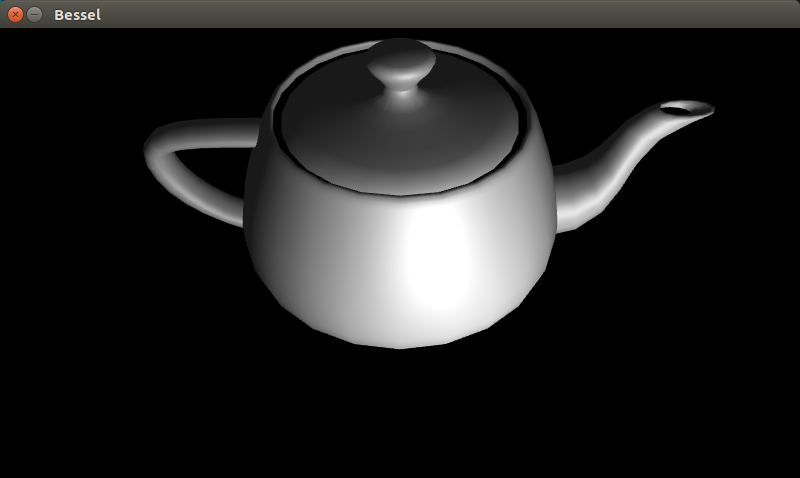
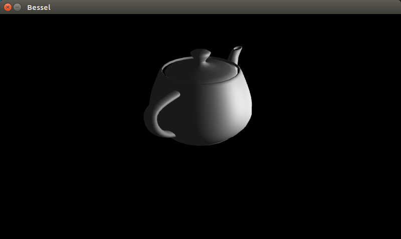
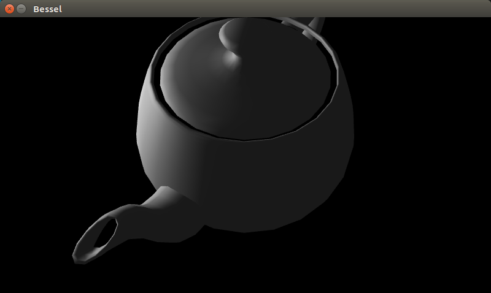

# 图形学项目报告
16337269 颜彬
## 构建方法
（本项目已包含可执行文件，此步骤可以跳过）
``` sh
# 在文件夹根目录下
$ make
```
## 运行方法
在根目录下
``` sh
$ make run
```
## 运行结果
见视频`程序运行视频-2018-06-18_14.36.44.mp4`
## 运行截图



## 控制方式
按下`W`, `A`, ,`S`, `D`, `J`, `K`, 可操控摄像机的位置。

## 文件介绍
### 根目录文件介绍
```
.
├── 16337269_颜彬_实验报告.md
├── common/
├── light/
├── distrib/
├── external/
├── .git
├── .gitignore
├── Makefile
├── .vscode
└── 程序运行视频-2018-06-18_14.36.44.mp4

5 directories, 4 files
```
- 16337269_颜彬_实验报告.pdf
实验报告
- Makefile
文件总Makefile
- light/
存放带有光源的茶壶的文件
- 程序运行视频-2018-06-08_11.36.39.mp4
程序运行的示范视频
## 实现思路
### 基础光照
本项目的光照基于冯氏光照模型。该模型是一种较为简单的光照模型。

冯氏光照模型中的光由环境光、漫反射光和镜面反射光三部分组成。

- 环境光照(Ambient Lighting)
即使在黑暗的情况下，世界上通常也仍然有一些光亮（月亮、远处的光），所以物体几乎永远不会是完全黑暗的。为了模拟这个，我们会使用一个环境光照常量，它永远会给物体一些颜色。
- 漫反射光照(Diffuse Lighting)
模拟光源对物体的方向性影响(Directional Impact)。它是冯氏光照模型中视觉上最显著的分量。物体的某一部分越是正对着光源，它就会越亮。
- 镜面光照(Specular Lighting)
模拟有光泽物体上面出现的亮点。镜面光照的颜色相比于物体的颜色会更倾向于光的颜色。

### 环境光
环境光是很少量的一种光照。将光的颜色（白色）乘以一个很小的因子，再乘以物体颜色，即产生环境光。
``` C++
void main()
{
    float ambientStrength = 0.1;
    vec3 ambient = ambientStrength * lightColor;

    vec3 result = ambient * objectColor;
    FragColor = vec4(result, 1.0);
}
```
### 漫反射光
漫反射光是冯氏光照模型中最显著的一种光照。其基于的原理是，光源与平面的夹角越小，光线越暗，夹角越大，光线越亮。为了刻画光线和平面的夹角，一般使用平面的法线和光线的夹角的余弦值来表示。余弦值越接近1，代表光照越强，越接近0则表示光照越弱。

obj文件中，一般自带面的法向量，故只需读取文件，并计算夹角即可。

值得注意的是，法向量一般是模型坐标系中的法向量。但光照的计算往往发生在世界坐标系。故需要对模型坐标系中的法向量做坐标变换，变换到世界坐标系中的法向量。值得注意的是，平移操作对向量是不起作用的。

如果采用四元组的方式表示向量，则第四维为0，所有的平移操作不会对该向量造成改变。直接采用矩阵运算即可完成法向量的坐标变换。
### 镜面光照
和漫反射光照一样，镜面光照也是依据光的方向向量和物体的法向量来决定的，但是它也依赖于观察方向，例如玩家是从什么方向看着这个片段的。镜面光照是基于光的反射特性。如果我们想象物体表面像一面镜子一样，那么，无论我们从哪里去看那个表面所反射的光，镜面光照都会达到最大化。

在计算镜面光照时，先假设发生了镜面反射，算出反射射出的光线的角度。再比较人的视角和射出的光线的角度。若两者越接近，则镜面反射的效果就越强，否则就越弱。
## 实现代码
### 顶点着色器
顶点着色器的代码很简单。其输入是每个顶点的坐标和该定点所在平面的法向量的坐标。相关的输入还有MVP矩阵，Model矩阵，View矩阵，光源在世界坐标系中的位置等。

其通过简单的数学运算，向段着色器输出定点世界坐标系的位置，法向量在摄像机坐标系中的位置，眼睛的方向和光的方向等。
``` C++
#version 330 core
// Input vertex data, different for all executions of this shader.
layout(location = 0) in vec3 vertexPosition_modelspace;
layout(location = 1) in vec3 vertexNormal_modelspace;

// Output data ; will be interpolated for each fragment.
out vec3 Position_worldspace;
out vec3 Normal_cameraspace;
out vec3 EyeDirection_cameraspace;
out vec3 LightDirection_cameraspace;

// Values that stay constant for the whole mesh.
uniform mat4 MVP;
uniform mat4 V;
uniform mat4 M;
uniform vec3 LightPosition_worldspace;

void main(){

	gl_Position =  MVP * vec4(vertexPosition_modelspace,1);
	Position_worldspace = 
		(M * vec4(vertexPosition_modelspace,1)).xyz;
	vec3 vertexPosition_cameraspace = 
		( V * M * vec4(vertexPosition_modelspace,1)).xyz;
	EyeDirection_cameraspace = 
		vec3(0,0,0) - vertexPosition_cameraspace;
	vec3 LightPosition_cameraspace = 
		( V * vec4(LightPosition_worldspace,1)).xyz;
	LightDirection_cameraspace = 
		LightPosition_cameraspace + EyeDirection_cameraspace;
	Normal_cameraspace = 
		( V * M * vec4(vertexNormal_modelspace,0)).xyz; 
}
```
### 段着色器
端着色器的实现分为三大部分，如上述冯氏模型所述。其分别计算环境光、漫反射光和镜面反射光，将其合并，产生最终的光照效果。

实现中用到了clamp函数，这是因为计算余弦值时，有可能出现结果为负数的情况。这是由于平面背对光源，法向量与光线形成的夹角不是锐角或直角。clamp将所有大于1的数截断到1，小于0的数截断到0.


``` C++
#version 330 core
in vec3 Position_worldspace;
in vec3 Normal_cameraspace;
in vec3 EyeDirection_cameraspace;
in vec3 LightDirection_cameraspace;

out vec3 color;

uniform mat4 MV;
uniform vec3 LightPosition_worldspace;

void main(){

	vec3 LightColor = vec3(1,1,1);
	float LightPower = 50.0f;
	vec3 MaterialDiffuseColor = vec3(1.0, 1.0, 1.0);
	vec3 MaterialAmbientColor = 
		vec3(0.1,0.1,0.1) * MaterialDiffuseColor;
	vec3 MaterialSpecularColor = vec3(0.3,0.3,0.3);

	float distance = 
		length( LightPosition_worldspace - Position_worldspace );

	vec3 n = normalize( Normal_cameraspace );
	vec3 l = normalize( LightDirection_cameraspace );
	// clamped above 0
	//  - light is at the vertical of the triangle -> 1
	//  - light is perpendicular to the triangle -> 0
	//  - light is behind the triangle -> 0
	float cosTheta = clamp( dot( n,l ), 0,1 );
	
	vec3 E = normalize(EyeDirection_cameraspace);
	vec3 R = reflect(-l,n);
	// clamped to 0
	//  - Looking into the reflection -> 1
	//  - Looking elsewhere -> < 1
	float cosAlpha = clamp( dot( E,R ), 0,1 );
	
	color = 
		// Ambient : simulates indirect lighting
		MaterialAmbientColor +
		// Diffuse : "color" of the object
		MaterialDiffuseColor * LightColor * LightPower * cosTheta / (distance*distance) +
		// Specular : reflective highlight, like a mirror
		MaterialSpecularColor * LightColor * LightPower * pow(cosAlpha,5) / (distance*distance);

}
```