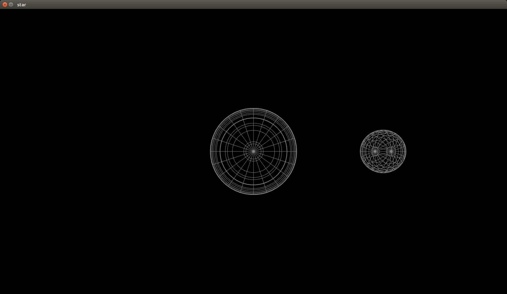

# 图形学项目报告
16337269 颜彬
## 构建方法
（本项目已包含可执行文件，此步骤可以跳过）
``` sh
# 在文件夹根目录下
$ make
```
## 运行方法
``` sh
$ make run
```
## 运行结果

## 文件介绍和运行平台
```
.
├── 16337269_颜彬_实验报告.html
├── 16337269_颜彬_实验报告.md
├── 16337269_颜彬_实验报告.pdf
├── common
├── cubic
├── cubic.png
├── distrib
├── external
├── helloworld
├── helloworld.png
└── Makefile

5 directories, 6 files
```
- 16337269_颜彬_实验报告.pdf
项目实验报告
- common/
放置各个程序都可能需要的共同的代码。例如跟着色器有关的辅助代码
- external/
外部库，存放例如`glew`, `glfw`, `glm`等库。
- helloworld/
实验一的源码。画出一个白色方框
- cubic/
实验二的源码，画出一个立体的正方形
- Makefile
构筑整个项目的Makefile 文件
- cubic.png, helloworld.png
两张截图
## 项目细节
### 实验一细节
`glfw`用于产生窗口。openGL本身不带有产生窗口的功能。故需要`glfw`作所有跟窗口有关的操作，包括事件响应等。

```C++
if (!glfwInit()) {
    // error handle
}
glfwWindowHint(...);
/*
    more glfwWindowHint here
*/
window = glfwCreateWindow(700, 700, "helloworld", NULL, NULL);
if (window == NULL)
{
    // error handle
}
```
首先通过glfwInit产生窗口。检测返回的错误码。若在该步产生错误，则直接结束程序。glfwWindowHint用于设置窗口信息，例如窗口大小和标题等。

openGL为了速度，是运行在显存上的，故openGL需要将内存的数据拷贝到显存上。openGL不能返回指向显存的指针，故大多数操作都是依靠openGL函数返回一个`ID`来完成的。用户通过向openGL传递这个ID，由openGL负责找到对应的buffer并读写数据。

例如下列代码

``` C++
GLuint vertexbuffer;
glGenBuffers(1, &vertexbuffer);
glBindBuffer(GL_ARRAY_BUFFER, vertexbuffer);
glBufferData(GL_ARRAY_BUFFER, 
    sizeof(g_vertex_buffer_data), 
    g_vertex_buffer_data, 
    GL_STATIC_DRAW
);
```
`GLuint`是为了保证跨平台而封装的`unsigned int`类型。`glGenBuffers`返回一个整数代表着新建的缓冲区。`glBufferData`将某片连续内存的值拷贝到缓冲区中。

其中的`g_vertex_buffer_data`的定义如下。
``` C++
static const GLfloat g_vertex_buffer_data[] = {
	-0.5f, 0.5f,
	0.5f, 0.5f,
	-0.5f, -0.5f,

	0.5f, -0.5f,
	0.5f, 0.5f,
	-0.5f, -0.5f
};
```
每两个浮点数为一组，表示`(x, y)`，三个二元组用于表示一个三角形。由于openGL所有支持的几何图形是点、线和三角形，所以这里用两个三角形拼接成一个矩形。这是openGL画矩形的唯一方法。

openGL的坐标是4元组。在着色器中，会把Z坐标补成0，把W坐标补成1.

拷贝完内容后，还需要告知openGL如何解释缓冲区中的数据。
``` C++
GLint posAttri = glGetAttribLocation(programID, "position");
glEnableVertexAttribArray(posAttri);
glBindBuffer(GL_ARRAY_BUFFER, vertexbuffer);
glVertexAttribPointer(
    posAttri,
    2,
    GL_FLOAT,
    GL_FALSE,
    2 * sizeof(GLfloat),
    0
);
```
`glGetAttribLocation`用于找到着色器代码中的`position`一项，并告知如何找到这一数据。`glVertexAttribPointer`中的`2`表示数据每2个为一组。`2*sizeof(GLfloat)`代表`stride`，即下一组数据相对于该组数据的偏移。最后一个`0`表示`offset`，即第一组数据相对于缓冲区开头的偏移量。

如此即可让openGL明白如何使用position数据。

最后的关键语句
```C++
glDrawArrays(GL_TRIANGLES, 0, 6); 
```
用于最后图画到画面上。

在程序结束前，还有一些资源回收操作，例如`delete Buffers`和`glfwTerminate`等不赘述，见源代码。

在ubuntu平台中，不使用着色器无法正常地画出图形。着色器使用`glsl`写成(语法类似于C语言)。在程序运行时，动态地传递字符串，并编译，告知显卡如何着色。

在本项目中给各个顶点着色。openGL会对中间的各个点的颜色作插值。

```C++
// in fragment shader
in vec3 Color;
// Ouput data
out vec4 out_color;

void main()
{

	// Output color = red 
	out_color = vec4(Color, 1.0);
}
```
在`fragment shader`中，直接将传入的`color`补成4维。openGL使用`rgba`四通道来描述颜色。如此即可在项目一中画出白色的矩形。
### 实验二细节
为了实现透视效果，需要作矩阵变换。

在最开始时，对象处于的坐标系是模型坐标系(model)。其中包括x,y,z三轴，每个轴从-1到1.

首先需要对模型的每个顶点作矩阵变换，从模型坐标系变换到世界坐标系(world)。由于本实验只有一个物体，故不需要作世界坐标系的变化。此处的变换矩阵取单位阵$I_4$.

然后需要将模型从世界坐标系转换到摄像机坐标系(camera).openGL提供了函数`glm::lookAt`，可以通过指定摄像机的位置、摄像机的观测方向和“上方向”来决定如何产生该变换矩阵。例如此处我们从`(3, 3, 6)`位置看向原点，并以y轴的正方向作为上方，则产生的变换矩阵由下列代码生成。
```C++
glm::mat4 View = glm::lookAt(
    glm::vec3(3, 3, 6),
    glm::vec3(0, 0, 0),
    glm::vec3(0, 1, 0)
);
```

最后要从世界坐标系变换到其次坐标系(homogeneous)。该变换的目的是实现近大远小的立体效果。
下列代码产生了变换矩阵。
``` C++
glm::mat4 Projection = glm::perspective(
    glm::radians(45.0f), 
    (float) 4 / (float) 3, 
    0.1f, 
    100.0f
);
```
第一个参数是摄像机广角，第二个参数是屏幕的长宽比。第三和第四个参数是最近和最远的单位。

当把这三个变换矩阵都求出来后，由矩阵变换的数学性质，可以求出这三个变换的复合，记为`mvp`

```C++
glm::mat4 mvp = Projection * View * Model;
```
如此，`mvp`即是这三个变换的复合对应的矩阵。将该矩阵传递到着色器中即可。在着色器中写如下代码。

``` C++
gl_Position = MVP * vec4(1*position, 1.0);
```
即可在产生坐标时先作矩阵变换。

## 实验心得
这次作业感觉最大的困难在于配置环境。由于以前比较少地配置C++环境，于是对`cmake`,`pkg-config`甚至动态库、静态库等概念不太熟。让本次项目跑起来花费了比较多的时间。

本实验参考了教程
http://www.opengl-tutorial.org/beginners-tutorials/tutorial-1-opening-a-window/
由于教程已经配置好了环境，但教程的框架定得比较死（我甚至不能修改项目的文件名），且教程的`cmake`写得比较复杂，于是我不得不自己重新配置了一遍环境。

本次实验在ubuntu 16.04LST下进行，使用`makefile`作为构筑工具。

由于openGL代码比较复杂，有些地方不得不参考（甚至直接引用）教程的代码。

例如着色器部分。openGL要求以字符串的形式在运行时把着色器代码传递给openGL，执行编译，并运行着色器（或在编译错误时返回错误信息）。教程为我们封装好了若干函数调用，用于打开文件、将文件内容转化成字符串等。这些代码并不是作图的核心，也比较繁琐，故我移植了教程中的实现。

经过这次项目，我对openGL的工作框架有了初步的了解。从宏观上知道了openGL的工作流程。我还对矩阵变换和坐标系变换有了更深入的了解。也对各个坐标系之间解耦的方便之处有了直观的体会。我也学习到了，项目构筑工具的使用和环境的配置。